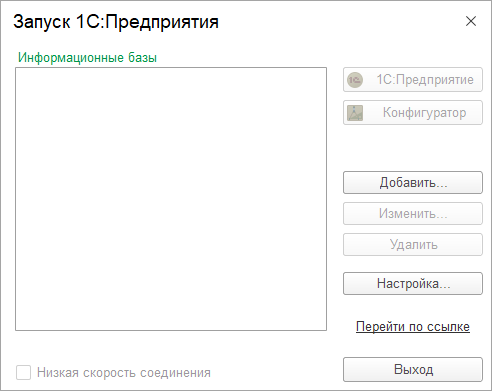
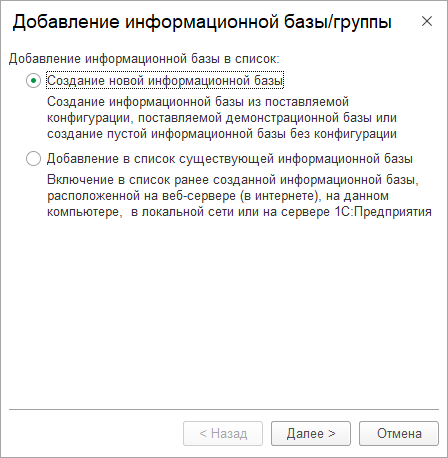
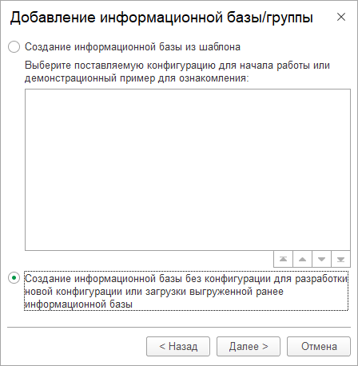
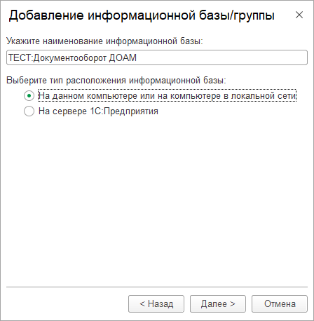
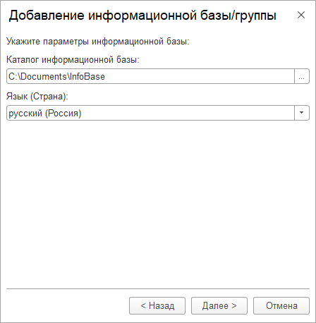

# Создание файловой информационной базы без конфигурации

|1C:Предприятие|8.3.18.1741
|:--- |:--- 
|Документооборот КОРП|2.1.29.17

## Решение вопроса

1. Запустить платформу `1С:Предприятие 8`, откроется окно `Запуск 1С:Предприятия`  
  
Нажать кнопку `Добавить...`
``` note
Будет запущен мастер `Добавление информационной базы/группы`
```

2. Выбрать пункт `Создание новой информационной базы` и нажать кнопку `Далее >`  


3. Выбрать пункт `Создание информационной базы без конфигурации для разработки...` и нажать кнопку `Далее >`  


4. Необходимо задать имя информационной базы.  
Выбрать пункт `На данном компьютере или на компьютере в локальной сети` и нажать кнопку `Далее >`  


5. Необходимо выбрать путь создания информационной базы через кнопку справа или клавишу [`F4`](#{{ site.lang }}).  
Нажать кнопку `Далее >`, затем кнопку `Готово`.  

``` note
Будет создана новая информационная база.  
Мастер `Добавление информационной базы/группы` будет закрыт.  
Новая база будет выделена в списке информационных в диалоговом окне `Запуск 1С:Предприятия`.
```

