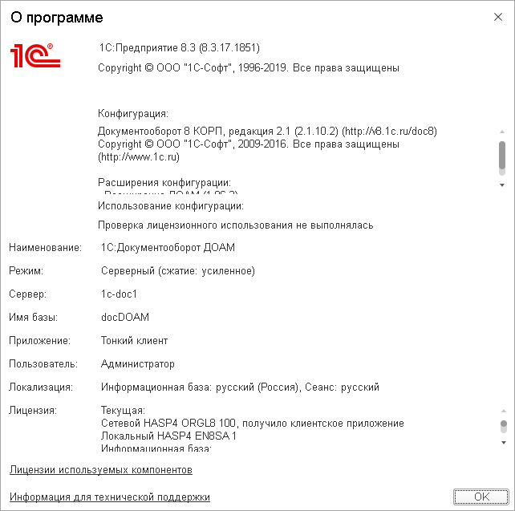
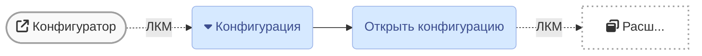
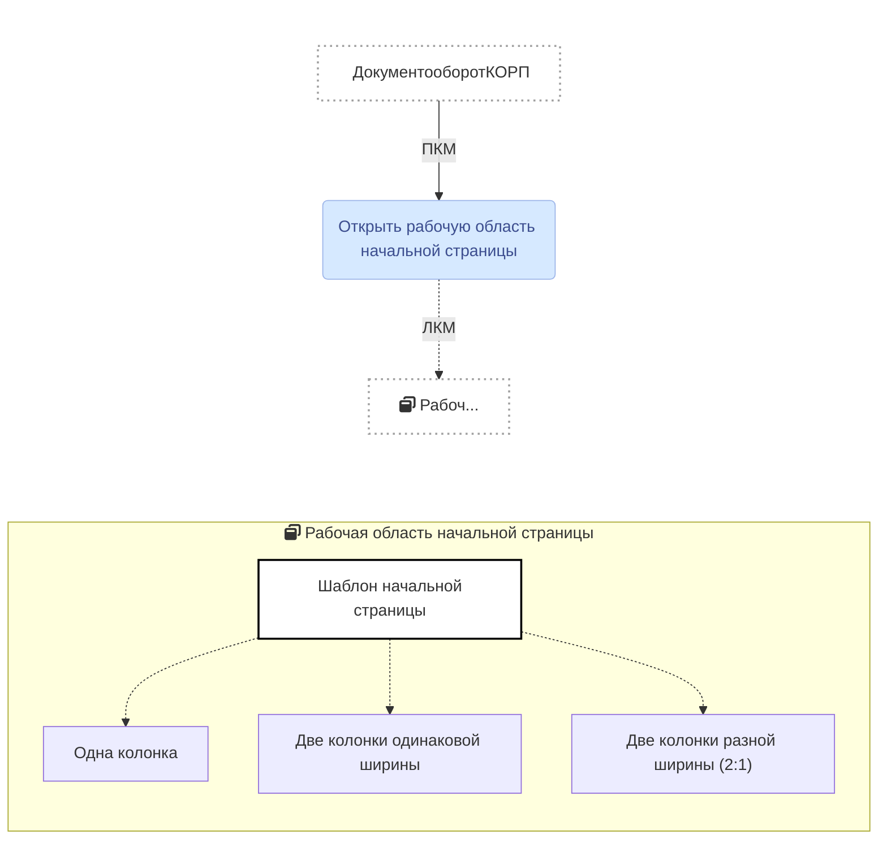
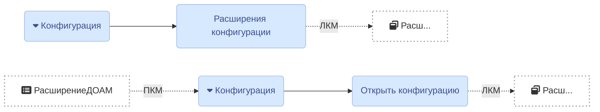

# После обновления пустой экран

Я говорил, что в версии 1C-8.3.12.1529 не переносятся настройки форм.

Решение нашёл случайно: если в Персональных настройках поставить галку «Запрашивать подтверждение при закрытии программы», то объекты формы тоже переносятся.


1. Первым делом необходимо проверить работу лицензионного ключа:



    ```mermaid
    graph TB
      classDef default fill:#facc1f,stroke:#a0a0a0,stroke-width:1px;
    ```


|1C:Предприятие|8.3.17.1851
|:--- |:--- 
|Документооборот КОРП|2.1.10.2
|Расширение ДОАМ|1.6.3

``` danger
**2020-12-24**  
После обновления компонентов C++ на Начальной странице клиента (Рабочий стол) 
отображается только белый экран.
```

## Разрешение конфликта

1. Открыть `Конфигурацию` в режиме конфигуратора (слева откроется окно)  

``` tip
Если `Конфигурация` открыта, показать окно можно горячими клавишами 
[`Ctrl+Shift+C`](#{{ site.lang }})
```

2. Проверить настройки Начальной страницы `Конфигурации` в поле `Шаблон 
начальной страницы`


3. Открыть `Расширение ДОАМ` и установить `Шаблон начальной страницы` как в 
`Конфигурации`

