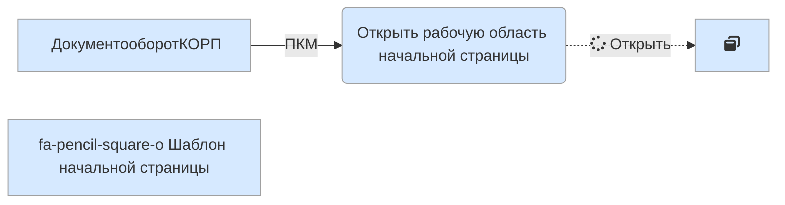

# После обновления пустой экран

    ```mermaid
    graph TB
      classDef default fill:#facc1f,stroke:#a0a0a0,stroke-width:1px;
    ```

|1C:Предприятие|8.03.17.1851
|:--- |:--- 
|Документооборот КОРП|2.01.10.2
|Расширение ДОАМ|1.06.03

``` danger
**2020-12-24**  
После обновления компонентов C++ на клиенте отображается только белый экран.
```

1. Первым делом необходимо проверить работу лицензионного ключа:


1. Открыть `Конфигурацию` в режиме конфигуратора (слева откроется окно)

2. Проверить настройки Начальной страницы `Конфигурации`

3. 
